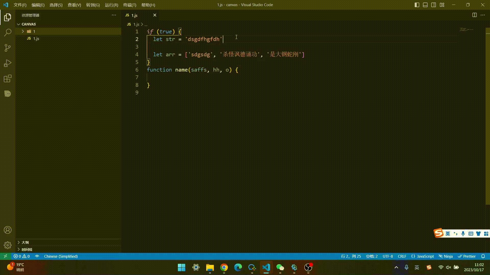
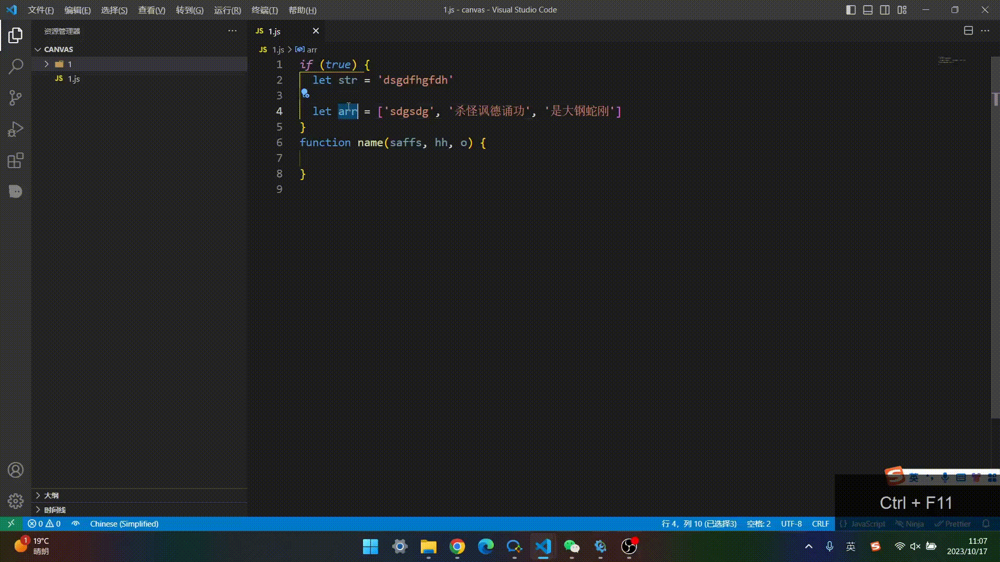

# README

[中文](README.md)

This is a plugin that helps you quickly print

You can input corresponding instructions at the beginning/end of the current line to trigger completion

it comes with a one click function to clear all `consoles` (in the `Print `right-click menu)

Comes with the function of deleting all comments and blank lines with one click (in the 'Print' right-click menu)

### Trigger instruction

When the command is triggered, if there is selected content, the selected content will be printed instead of the current line

| command       |                      result |
| ---------- | ------------------------: |
| log        | console.log(lineContent) |
| table      | console.table(lineContent) |
| dir        | console.dir(lineContent) |
| warn       | console.warn(lineContent) |
| error      | console.error(lineContent) |

| Shortcut keys    |                      result |
| ---------- | ------------------------: |
| ctrl+alt+l | console.log(lineContent) |
| ctrl+alt+t | console.table(lineContent) |
| ctrl+alt+d | console.dir(lineContent) |
|            | console.warn(lineContent) |
|            | console.error(lineContent) |

### Example

 

### note

- It is recommended to enable the `"files.insertFinalNewline": true,` configuration item, otherwise it will not be printed if the line to be printed is the last line

- When there is a situation where the ` (` and `) ` are not equal in the line to be printed, and the next line is a similar logical code, it is recommended to manually print it, otherwise the printed line may be incorrect

- When entering instructions to complete at the start position, if the code immediately following it is deleted, **it is recommended to separate the start and end positions with spaces when triggering the instruction**

#### The shortcut keys can be modified by yourself

Other functions can be viewed in the right-click menu 'Print'

#### If you like this plugin, please give me a star. Thanks

**Enjoy!**
