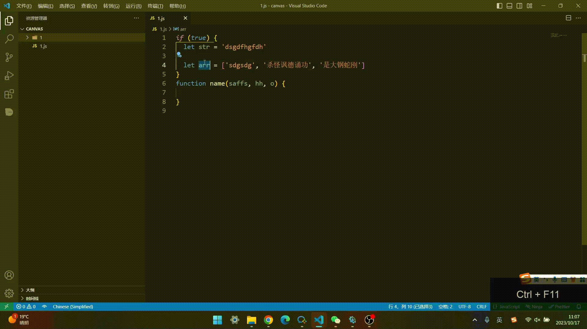

# README

[English](README.EN.md)

这是一个帮助你快速打印的插件

可以在当前行的开始/结尾处输入相应的指令进行触发补全

并附带一键清空所有`console`的功能(在右键菜单的`Print`中)

### 触发指令

触发指令时, 如果有已选择的内容则会打印已选择的内容, 而不是当前行

| 指令       |                      结果 |
| ---------- | ------------------------: |
| log        | console.log(lineContent) |
| table      | console.table(lineContent) |
| dir        | console.dir(lineContent) |
| warn       | console.warn(lineContent) |
| error      | console.error(lineContent) |

| 快捷键     |                      结果 |
| ---------- | ------------------------: |
| ctrl+alt+l | console.log(lineContent) |
| ctrl+alt+d | console.table(lineContent) |
| ctrl+alt+d | console.dir(lineContent) |
|            | console.warn(lineContent) |
|            | console.error(lineContent) |

### 示例

 

### 注意

- 建议开启 `"files.insertFinalNewline": true,` 配置项, 否则如果需要打印的行是最后一行 不会进行打印

- 当需要打印的行中如果存在 `str = text.trim()?.split('(') || ''` 这种 `(` 和 `)` 不相等, 下一行又是别的逻辑代码时的类似的情况, 建议手动打印, 否则如果当前文件过大, 会非常消耗性能

#### 快捷键可以自行修改

其他的可以在右键菜单查看

**Enjoy!**
